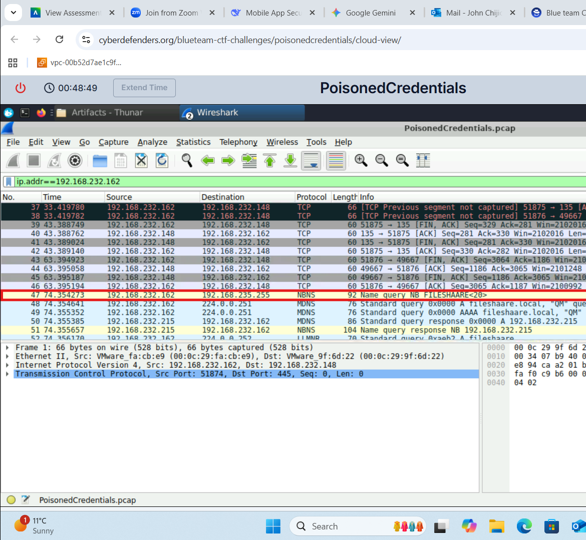
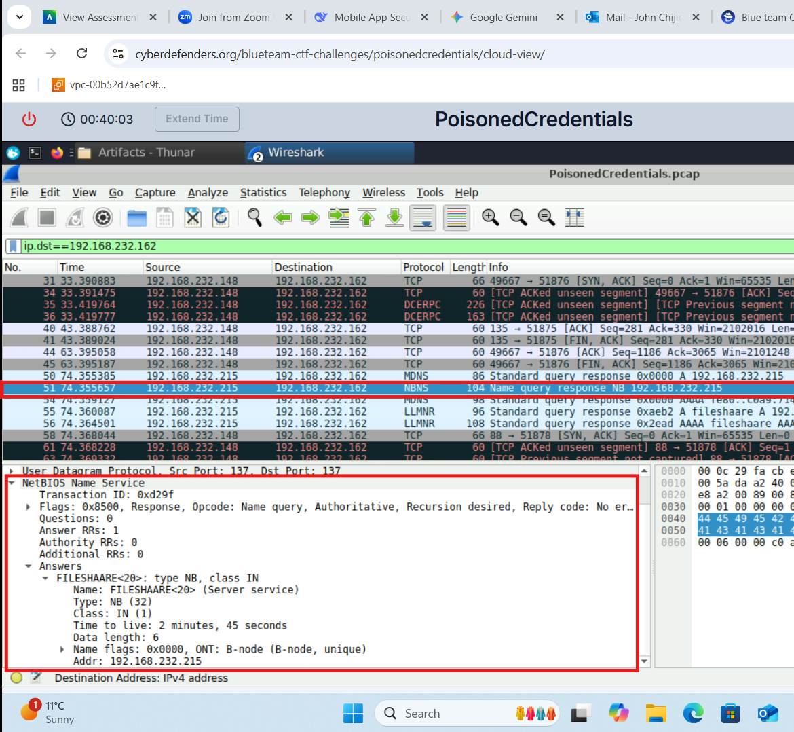
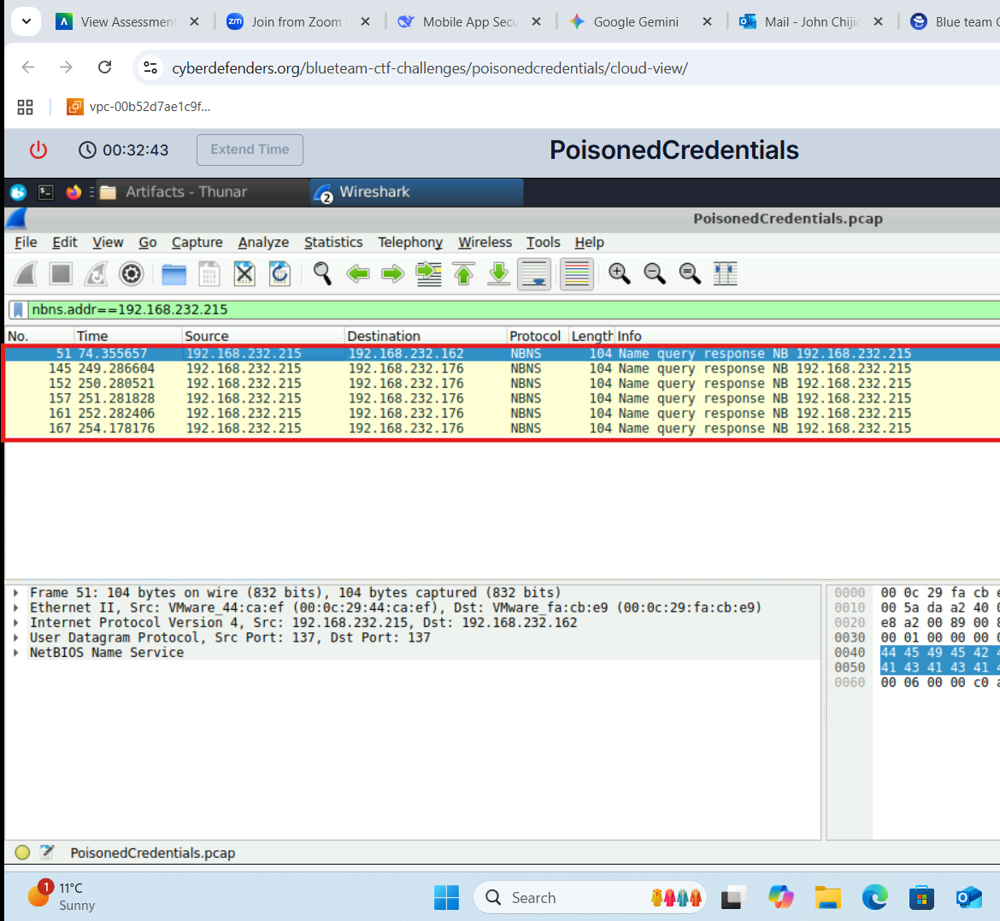
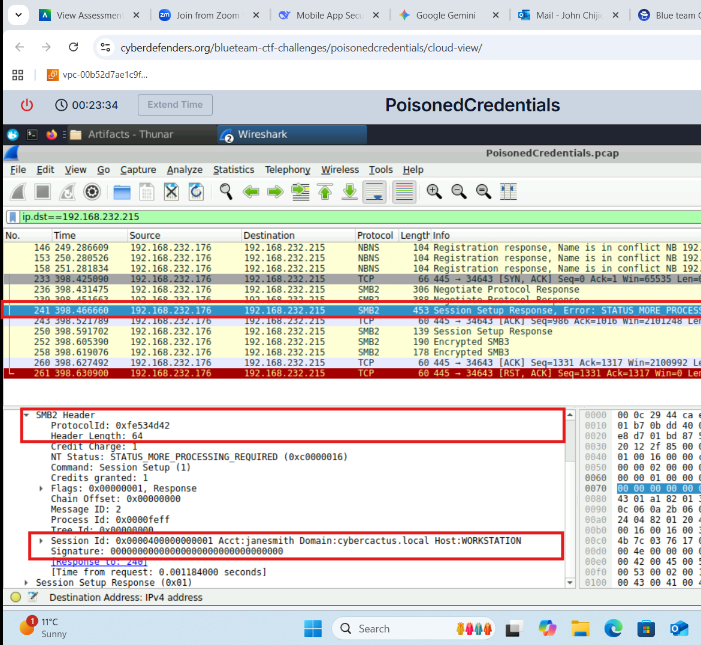
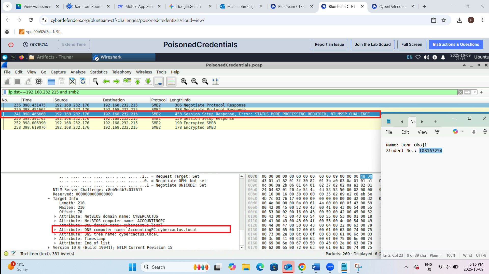

# Poisoned Credentials: Network Forensics Investigation

## Overview

This project documents a network forensics investigation into suspicious network activity involving credential poisoning.

Using Wireshark and captured network traffic, the investigation focused on identifying evidence associated with LLMNR/NBT-NS poisoning, examining affected systems, tracing credential exposure, and analyzing related SMB network activity.

The project demonstrates how packet-level evidence can be used to reconstruct suspicious activity and develop findings during a network security investigation.

> **Note:** This investigation was performed in a controlled academic environment using provided network capture evidence.

## Tools and Technologies

- Wireshark
- PCAP Analysis
- LLMNR
- NBT-NS
- SMB
- TCP/IP
- Network Forensics
- Packet Analysis

## Investigation Objectives

- Analyze captured network traffic using Wireshark
- Identify suspicious LLMNR and NBT-NS activity
- Determine systems involved in the suspicious traffic
- Investigate evidence of credential exposure
- Examine SMB-related network activity
- Correlate packet evidence to reconstruct the incident
- Document findings from the investigation

## Investigation Process

### 1. Evidence Review

The investigation began by examining the provided packet capture in Wireshark.

Network traffic was reviewed and filtered to identify protocols and communication patterns relevant to the suspected credential-poisoning activity.

#### PCAP Investigation Overview

*Initial review of the captured network traffic in Wireshark to identify suspicious communication patterns and relevant protocols.*

### 2. LLMNR/NBT-NS Analysis

The captured traffic was examined for LLMNR and NBT-NS activity associated with the suspected credential-poisoning incident.

These name-resolution protocols were important to the investigation because they helped reveal how systems attempted to resolve network names and how another host responded to those requests.

#### LLMNR/NBT-NS Traffic Analysis

*Wireshark analysis of LLMNR/NBT-NS traffic used to investigate suspicious name-resolution activity.*

The packet evidence was then examined further to identify the response associated with the suspected poisoning activity.

#### Poisoning Response Evidence

*Packet-level evidence examined to identify the host responding during the suspicious name-resolution exchange.*

### 3. Identification of Involved Systems

The network evidence was analyzed to identify the systems involved in the suspicious activity.

IP addresses, packet direction, and communication patterns were correlated to distinguish the system generating the name-resolution request from the system responding to it.

#### Involved Hosts Analysis

*Packet evidence used to correlate network addresses and identify systems involved in the suspicious communication.*

Correlating the hosts across multiple packets helped establish the relationship between the systems and provided additional context for the credential-poisoning investigation.
### 4. Credential Exposure Investigation

The investigation continued by examining authentication-related traffic associated with the suspicious name-resolution activity.

Packet evidence was reviewed to identify authentication attempts and determine whether credential information was exposed during the incident.

#### Authentication Evidence

*Authentication-related network evidence examined in Wireshark as part of the credential-poisoning investigation.*

The authentication evidence was correlated with the previously identified name-resolution and host activity to better understand how the credential exposure occurred.

This demonstrated the importance of examining multiple related network events rather than treating authentication traffic in isolation.

### 5. SMB Traffic Analysis

SMB-related traffic was examined to understand the network activity associated with the suspected credential-poisoning incident.

The SMB communication provided additional context for the authentication activity observed during the investigation and helped connect the name-resolution activity with subsequent communication between the involved systems.

By reviewing the relevant packets and their sequence, the investigation was able to follow the activity beyond the initial LLMNR/NBT-NS exchange and better understand how the systems interacted during the incident.

### 6. Evidence Correlation

The final stage of the investigation involved correlating evidence from the LLMNR/NBT-NS traffic, involved hosts, authentication activity, and SMB communications.

Rather than relying on a single packet or indicator, the investigation used multiple pieces of network evidence to reconstruct the sequence of suspicious activity.

### Investigation Findings

The analysis established a relationship between:

- Suspicious LLMNR/NBT-NS name-resolution activity
- The systems involved in the request and response
- Authentication activity associated with the incident
- Evidence of credential exposure
- Subsequent SMB-related network communication

By correlating these events, the investigation demonstrated how packet-level evidence can be used to trace suspicious network behaviour and understand how credential-poisoning activity develops across multiple protocols.

### Investigation Conclusion

The exercise demonstrated the importance of examining network events as part of a larger sequence rather than analyzing individual packets in isolation.

Combining name-resolution, authentication, host, and SMB evidence provided a more complete understanding of the incident and strengthened the reliability of the investigative findings.

## Skills Demonstrated

- Network Forensics
- Wireshark Packet Analysis
- PCAP Investigation
- LLMNR/NBT-NS Analysis
- Credential Exposure Investigation
- SMB Traffic Analysis
- Network Protocol Analysis
- Evidence Correlation
- Incident Investigation
- Technical Documentation

## Defensive Recommendations

Based on the attack pattern investigated in this project, defensive considerations include:

- Reducing reliance on unnecessary legacy name-resolution protocols
- Monitoring for abnormal LLMNR and NBT-NS responses
- Monitoring authentication activity for suspicious credential usage
- Restricting unnecessary SMB communication
- Applying network segmentation where appropriate
- Investigating unusual internal name-resolution and authentication traffic

## Key Takeaway

This project strengthened my understanding of how network packet evidence can be used during a cybersecurity investigation.

By examining name-resolution traffic, authentication activity, affected systems, and SMB communications, I was able to correlate multiple pieces of evidence and reconstruct suspicious activity from a network-forensics perspective.

The exercise reinforced the importance of understanding normal network protocols because legitimate functionality can sometimes be abused during credential-based attacks.
